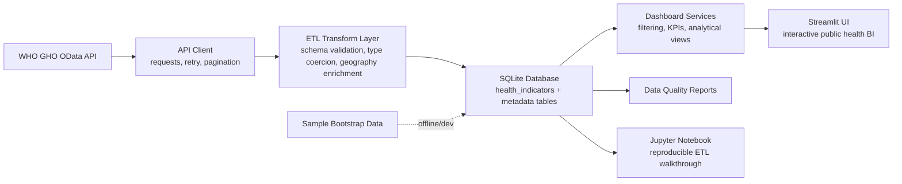

# WHO Global Health Intelligence Platform

**Public Health Data Engineering, Epidemiological Analytics & Interactive Business Intelligence**

[](https://www.python.org/)
[](LICENSE)

---

## 1. Professional description

The **WHO Global Health Intelligence Platform** is an open-source public health data engineering and analytics project for extracting, validating, storing, and visualizing selected indicators from the World Health Organization (WHO) Global Health Observatory (GHO).

The platform is designed for reproducible descriptive analysis, data quality review, epidemiological exploration, and interactive business intelligence dashboards.

> **Scope statement:** This project is a **public health data engineering and analytics platform**. It is **not currently a validated AI prediction system**, forecasting product, clinical decision-support tool, or medical diagnostic system.

Current scope:

- The platform focuses on selected WHO GHO indicators configured in this repository; it does not ingest the entire WHO GHO catalog.
- Default live extraction attempts `LIFE_EXPECTANCY`, `NCD_MORTALITY`, and `UHC_COVERAGE`; additional configured indicators can be requested explicitly.
- Database contents depend on the workflow used: live WHO API extraction, local sample bootstrap data, or notebook sample mode.

---

## 2. Project purpose

This repository provides a transparent workflow for:

- retrieving selected WHO GHO indicators through a documented ETL pipeline;
- normalizing and validating health indicator records;
- storing records in an idempotent SQLite database;
- generating quality reports and metadata tables;
- supporting offline development through sample data workflows;
- presenting descriptive analytics through a Streamlit dashboard and a reproducible notebook.

The project emphasizes clear separation of concerns, transparent assumptions, and responsible interpretation of public health data.

---

## 3. Architecture



### Separation of concerns

- `src/who_health_intelligence/dashboard/services.py` contains data loading, filtering, KPI calculation, analytical view builders, quality summaries, and export helpers.
- `src/who_health_intelligence/dashboard/app.py` contains Streamlit layout and UI orchestration only.
- ETL logic is implemented in reusable modules under `src/who_health_intelligence/etl/` and exposed through `main.py` and `who_etl_pipeline.py`.

---

## 4. Main capabilities

- WHO GHO API extraction with retry handling, pagination, and configurable indicators.
- Schema validation and transformation of raw WHO API records.
- Country and continent enrichment for geographic analysis.
- Idempotent database loading with uniqueness constraints and replace-before-insert behavior.
- Metadata tables for indicator definitions, source information, and ETL run tracking.
- Data quality reporting for completeness, duplicates, coverage, invalid values, and unmapped countries.
- Interactive Streamlit dashboard with geographic, ranking, trend, comparison, profile, distribution, association, and data explorer views.
- Reproducible Jupyter notebook generation and execution support.
- Offline/development sample data workflow for environments without network access.

---

## 5. Data source

| Source | Description | Endpoint |
|---|---|---|
| WHO Global Health Observatory (GHO) OData API | WHO-published global health indicator data | `https://ghoapi.azureedge.net/api/` |

WHO data can be revised over time. Results produced by this repository depend on the extraction date, selected indicators, API availability, and any subsequent WHO revisions.

---

## 6. Indicator definitions

Configured indicators are maintained in `src/who_health_intelligence/utils/config.py`.

| Internal name | WHO API code | Description in project configuration |
|---|---:|---|
| `LIFE_EXPECTANCY` | `WHOSIS_000001` | Life expectancy at birth (years) |
| `NCD_MORTALITY` | `NCDMORT3070` | Probability of dying from noncommunicable diseases between ages 30 and 70 (%) |
| `UHC_COVERAGE` | `UHC_INDEX_REPORTED` | Universal Health Coverage service coverage index (1-100) |
| `MATERNAL_MORTALITY` | `MAT_4` | Maternal mortality ratio (per 100,000 live births) |
| `INFANT_MORTALITY` | `WHOSIS_000002` | Infant mortality rate (per 1,000 live births) |

**Important:** Indicator definitions, units, age ranges, disaggregation fields, and methodological notes must be checked against the official WHO source before publication or policy use.

---

## 7. Technology stack

| Layer | Technology |
|---|---|
| Language | Python 3.9+ |
| Data processing | pandas, NumPy |
| API access | requests, urllib3 retry support |
| Database | SQLite |
| Dashboard | Streamlit |
| Visualization | Plotly |
| Notebook | Jupyter, nbformat, nbclient |
| Testing | pytest |

---

## 8. Repository structure

```text
who-health-intelligence/
├── main.py                              # CLI entry point
├── who_etl_pipeline.py                  # Standalone ETL pipeline CLI
├── WHO_Data_Extraction_ETL.ipynb        # Generated reproducible notebook
├── requirements.txt                     # Python dependencies
├── src/config.py                        # Centralized project configuration
├── src/data_quality.py                  # Reusable data quality functions
├── src/analytics.py                     # Reusable descriptive analytics functions
├── LICENSE                              # MIT license
├── data/                                # Generated SQLite databases and reports
├── logs/                                # Runtime logs
├── scripts/
│   ├── bootstrap_data.py                # Offline/development sample data generation
│   └── generate_notebook.py             # Notebook generator
├── src/who_health_intelligence/
│   ├── api/client.py                    # WHO GHO API client
│   ├── dashboard/
│   │   ├── app.py                       # Streamlit UI
│   │   └── services.py                  # Dashboard data service layer
│   ├── etl/
│   │   ├── loader.py                    # SQLite loading and metadata
│   │   ├── metadata.py                  # Geography metadata and normalization
│   │   ├── pipeline.py                  # Package ETL orchestrator
│   │   ├── quality.py                   # Data quality reporting
│   │   ├── schema.py                    # Validation rules
│   │   └── transform.py                 # Record transformation
│   └── utils/config.py                  # Paths, API endpoint, indicators, logging
└── tests/                               # Automated test suite
```

---

## 9. Installation instructions

```bash
git clone https://github.com/AliNaderiii/who-health-intelligence.git
cd who-health-intelligence
python -m venv .venv
source .venv/bin/activate        # Windows: .venv\Scripts\activate
python -m pip install --upgrade pip
pip install -r requirements.txt
```

If you run modules directly from the repository without installing a package, set `PYTHONPATH` as shown below.

---

## 10. Environment setup

```bash
export PYTHONPATH=src:.
export WHO_DB_PATH=data/who_health_data.db
export LOG_LEVEL=INFO
```

Environment variables:

| Variable | Purpose | Default |
|---|---|---|
| `WHO_DB_PATH` | SQLite database path used by the app and CLI | `data/who_health_data.db` |
| `WHO_DATA_DIR` | Base data directory | `data/` |
| `WHO_RAW_DATA_PATH` | Raw API response directory | `data/raw/` |
| `WHO_PROCESSED_DATA_PATH` | Processed output directory | `data/processed/` |
| `WHO_METADATA_PATH` | Metadata output directory | `data/metadata/` |
| `WHO_API_BASE_URL` | WHO GHO API base URL | `https://ghoapi.azureedge.net/api/` |
| `WHO_RETRY_COUNT` | Default API retry count | `3` |
| `WHO_REQUEST_TIMEOUT` | Default request timeout in seconds | `30` |
| `LOG_LEVEL` | Application logging level | `INFO` |
| `PYTHONPATH` | Allows imports from `src/` during local development | `src:.` |

---

## 11. Pipeline execution instructions

### Package CLI

```bash
python main.py etl
python main.py etl --indicators NCD_MORTALITY UHC_COVERAGE
python main.py etl --quality-report data/quality_report.md
```

### Standalone ETL CLI

```bash
python who_etl_pipeline.py
python who_etl_pipeline.py --indicator NCD_MORTALITY UHC_COVERAGE
python who_etl_pipeline.py --db-path data/who_health_data.db --quality-report data/quality_report.md
```

Standalone pipeline exit codes:

| Code | Meaning |
|---:|---|
| `0` | Success |
| `1` | General failure |
| `2` | No data extracted |
| `3` | Validation failure |

Live extraction requires access to the WHO GHO API. Some network environments may block or fail API requests.

---

## 12. Sample mode instructions

Use sample workflows when the WHO API is unavailable or when a fast local demonstration is needed.

### Generate an offline sample database

```bash
python scripts/bootstrap_data.py
```

This creates development sample data in the configured SQLite database. Treat it as synthetic/demo data, not official WHO observations.

### Limit records during ETL testing

```bash
python who_etl_pipeline.py --sample 100
```

`--sample` limits records after extraction for fast testing. It still requires API access.

### Notebook sample mode

The generated notebook contains:

```python
SAMPLE_MODE = True
```

When `SAMPLE_MODE` is `True`, the notebook uses the local database instead of attempting live API extraction. Set it to `False` only when live WHO API access is available.

---

## 13. Database generation instructions

Create or refresh `data/who_health_data.db` using one of these workflows:

```bash
# Official WHO API workflow, subject to network/API availability
python who_etl_pipeline.py --db-path data/who_health_data.db --quality-report data/quality_report.md

# Package CLI alternative
python main.py etl --quality-report data/quality_report.md

# Offline/development workflow with synthetic sample data
python scripts/bootstrap_data.py
```

Inspect the database:

```bash
python main.py info
```

The main table is `health_indicators`. Metadata tables include `indicator_definitions`, `source_info`, and `etl_metadata`.

---

## 14. Streamlit launch instructions

```bash
# CLI launcher
python main.py dashboard

# Optional custom port
python main.py dashboard --port 8501

# Direct Streamlit launcher
streamlit run src/who_health_intelligence/dashboard/app.py
```

The dashboard reads from the configured SQLite database path. If no data is available, run the ETL or sample bootstrap workflow first.

---

## 15. Notebook execution instructions

Generate or refresh the notebook:

```bash
python main.py notebook
# or
python scripts/generate_notebook.py
```

Open and execute:

```bash
jupyter notebook WHO_Data_Extraction_ETL.ipynb
```

Optional command-line execution:

```bash
jupyter nbconvert --to notebook --execute WHO_Data_Extraction_ETL.ipynb --output executed_notebook.ipynb
```

For offline execution, keep `SAMPLE_MODE = True` inside the notebook and ensure `data/who_health_data.db` exists.

---

## 16. Testing instructions

```bash
export PYTHONPATH=src:.
pytest tests/ -v
```

Run targeted test modules:

```bash
pytest tests/test_pipeline.py -v
pytest tests/test_services.py -v
pytest tests/test_notebook.py -v
pytest tests/test_quality.py -v
```

The tests cover ETL transformation and validation, database loading, dashboard services, metadata handling, data quality reporting, the standalone pipeline, and notebook structure.

---

## 17. Data quality checks

Generate a quality report from the current database:

```bash
python main.py quality --output data/quality_report.md
```

Quality checks include:

- row counts and indicator coverage;
- missing-value rates by column;
- duplicate record detection;
- temporal and geographic coverage;
- invalid or out-of-range value detection;
- unmapped country/territory review;
- metadata availability.

Quality checks support data review but do not guarantee that the data are complete, current, or appropriate for every analytical use case.

---

## 18. Dashboard screenshots

Screenshots are not bundled in this repository by default. Suggested locations for documentation images:

| Dashboard view | Placeholder path |
|---|---|
| Geographic choropleth | `docs/screenshots/geographic_view.png` |
| Country ranking | `docs/screenshots/ranking_view.png` |
| Temporal trends | `docs/screenshots/trend_view.png` |
| Indicator comparison | `docs/screenshots/comparison_view.png` |
| Country profile | `docs/screenshots/country_profile_view.png` |
| Distribution analysis | `docs/screenshots/distribution_view.png` |
| Statistical association | `docs/screenshots/association_view.png` |
| Data explorer | `docs/screenshots/data_explorer_view.png` |

Add screenshots only when they are generated from a documented database state and do not imply unsupported performance or policy claims.

---

## 19. Limitations

- This project is descriptive analytics software, not a validated AI prediction system.
- Correlation does not imply causation.
- Country averages may be unweighted unless population data is included.
- WHO data may contain missing values, reporting gaps, methodological changes, and revisions.
- Indicator definitions and units must be checked against the WHO source before external use.
- API availability and SSL/network configuration can affect live extraction.
- Gender, age, and geographic disaggregation availability varies by indicator.
- Country and territory mappings may not cover every WHO reporting entity.
- Sample/bootstrap data are for development and demonstration only.
- The dashboard is not a medical decision-support tool.
- The project should not be used for clinical decisions.

---

## 20. Ethics and responsible interpretation

Public health indicators describe complex social, epidemiological, economic, and health-system contexts. Users should:

- interpret trends and differences with attention to reporting practices, data completeness, and uncertainty;
- avoid causal claims from descriptive charts or correlations alone;
- document extraction dates, indicator definitions, filters, and aggregation methods;
- avoid stigmatizing countries, regions, populations, or health systems based on incomplete data;
- consult domain experts and official WHO metadata before using results in reports, policy analysis, or operational planning;
- never use this project as a substitute for clinical judgment, medical advice, or validated decision-support systems.

---

## 21. License

This project is released under the **MIT License**. See [LICENSE](LICENSE) for the full license text.

---

## 22. Author information

**Author:** Ali Naderi

**Repository:** https://github.com/AliNaderiii/who-health-intelligence

**Project focus:** public health data engineering, epidemiological analytics, and interactive business intelligence.

---

## 23. Attribution

Data source attribution belongs to the **World Health Organization Global Health Observatory**. This repository is an independent open-source software project and does not imply WHO endorsement.
